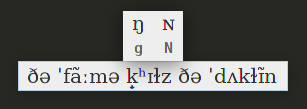
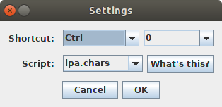
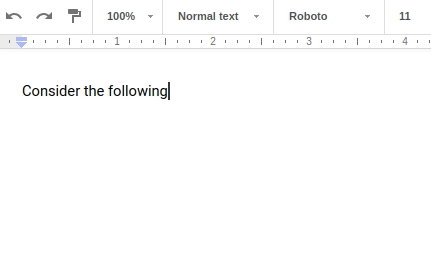
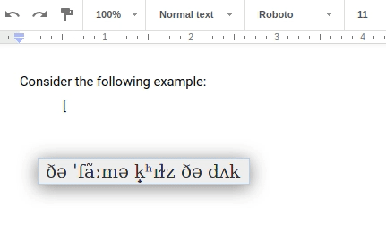
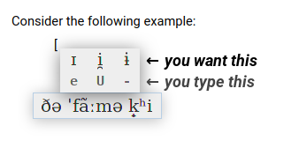

## about



_scribo_ is a tool to help you __type strange Unicode characters without leaving the comfort of your familiar keyboard layout__. For example, you can use it to:

* type in the Greek or Cyrillic alphabet without learning a new keyboard layout
* efficiently write phonetic transcriptions in the IPA (International Phonetic Alphabet), including diacritics
* insert various math symbols without leaving your editor
* define shortcuts for certain special characters you use frequently
* make a weird keyboard layout where none of the letters are where they're supposed to be (heaps of fun!)

_scribo_ is currently in alpha (2018-02-24).

## download and install

[__DOWNLOAD__](download/20180224_scribo.zip)

__NOTE:__ _scribo_ is still in early alpha stage. If you run into problems, please [create an issue](https://github.com/phigames/scribo/issues) or contact me: 

### system requirements

* Java 1.8 or higher
* Windows 2000+, Apple OSX 10.5+ or X11 Linux
* 256 MB of RAM

### instructions

Download the zip archive and extract the contents anywhere on your computer.

To start _scribo_, run `scribo.jar` (double-click or `java -jar scribo.jar`). On some Unix systems, you might have to run `chmod +x scribo.jar` first.

## use

You can set the script you want to write in and a shortcut for activating _scribo_ in the settings window:



__IMPORTANT:__ Choose a shortcut that isn't already used by the editor you're using in order to avoid strange behavior.

To enter text in the chosen script, use the shortcut and start typing:



When you're done, hit `ENTER`. The text you just typed is automatically copied into your clipboard and you can enter it using `Ctrl` `V`.



When you press a key, all the variations of characters associated with this key are displayed. In the following example, three variations of the character 'i' appear when the key `I` is pressed: 



So then, if you want to type a 'ɪ', you hit `E` (the character that appears below the desired character). Try it out, it will make sense very quickly... ;)

## customize

Scripts are `.chars` files that define combinations of characters (enterable in your familiar keyboard layout) that generate the desired special characters. For example, `a + e = æ` means "type an 'a', then a 'e', and you'll get a 'æ'". Note that the parts in the equation are _not_ the keys on your keyboard, but the _characters_ those keys produce. This means that you can define equations like this:

```
a + e = æ   # type 'a', then 'e'
A + E = Æ   # type capital 'A', then capital 'E'
a + \ = à   # type 'a', then '\'

# also possible*:
y = ü       # type 'y', get 'ü'

# the right hand side can be a string of characters:
f = ph      # type 'f', get 'ph'
% = Heya!   # type '%', get 'Heya!'
```
*At the moment, 1 or 2 characters on the left hand side are allowed, no more.

To define your own script, write equations in a file, name it `[my_script].chars` and put it inside the `res/` folder in _scribo_'s installation directory. _scribo_ will detect it automatically and you can select it in the settings window.

A more detailed description of how scripts work can be found here: <sup>[work in progress]</sup>

## license and other boring stuff

_scribo_ is free and open-source. View the latest source code at the [GitHub repository](https://github.com/phigames/scribo).

_scribo_ uses the [JNativeHook](https://github.com/kwhat/jnativehook) library, which is published under the [GNU General Public License v3.0](https://www.gnu.org/licenses/gpl-3.0.en.html).
